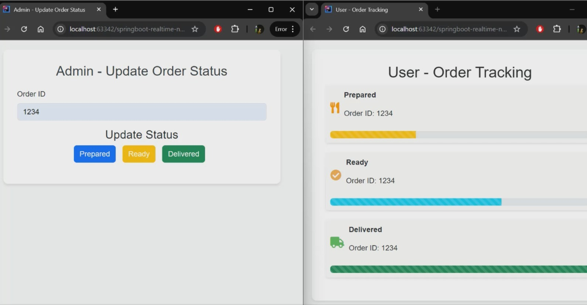

# Order Lifecycle Notification System with WebSocket

## Introduction

This project is a **real-time notification system** for tracking order status using **Spring Boot** and **WebSockets**. It bridges the gap between administrators updating order statuses and users tracking them, ensuring seamless, instant communication. 

---

## About the Project

### What does it do?
1. **Admin View**: Enables administrators to update order statuses (Prepared, Ready, Delivered).
2. **User View**: Displays order progress in real time with dynamic UI updates.

### Technologies and Concepts:
- **WebSockets** for real-time, bi-directional communication.
- **Spring Boot** for backend services and WebSocket endpoints.
- **Bootstrap** and **JavaScript** for responsive and interactive UI.
- **JSON Messaging** for data exchange.

---

## Real-Time Scenario

### Use Case: Food Delivery
- **Without Real-Time Updates**: Customers refresh pages or call for updates.
- **With This Project**: Instant notifications enhance customer experience, making order tracking effortless.
